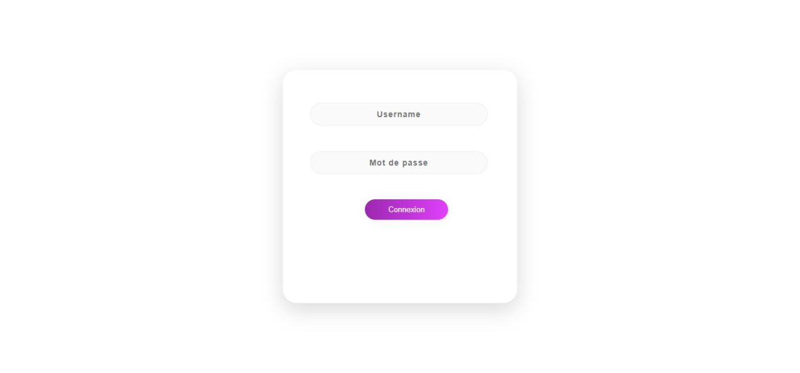

# Contributors

Etudiante: SAHRAOUI Fatima-Ezzahra :smile:
Etudiant : RAMZI Mouad :smile:

# Objectifs
Une platforme qui a comme but d’administrer les annonces, les modifier, les supprimer , 
en les associant des illustrations sur les quelles on peut appliquer la meme chose c'est à dire tout Operation de CRUD

# Versions
Version de Grails : 3.3.8

Java : OpenJDK 1.8

Git : version non pertinente

# Démarrage
Apres cloner le projet dans votre local et faire le build ,
il faut changer le path des images qui correspond à votre local pour n’avoir aucun problème concernant l’affichage des images,
après leur insertion , et c’est à partir du fichier "grails-app[main]/conf/spring/application.yml" ou vous allez trouver le basePath pour les illustrations:
# Langage,programmes  et ressources 
groovy(back-end) 
HTML,CSS (front-end)
Intellij (IDE de travail)
Spring Security
# Besoins fonctionnels 

On est concernés par 3 utilisateurs qui pourront avoir 3 rôles différents respectivement:
ADMIN , MODERATOR , CLIENT .
chacun d’eux peut s’identifier et se déconnecter également à tout moment.
Apres effectuer son login , l’administrateur peut  Créer ,gérer ,Visualiser , Mettre à jour , Supprimer Des utilisateurs ainsi que des annonces (avec upload d’illustrations et leurs images) , 
alors il peut accéder à chaque annonce à partir d’un tableau qui les regroupe tous (chaque annonce avec l’utilisateur associé) ,
puis il peut appliquer toute opération voulue du CRUD , il peut également modifier une annonce pour ajouter plus d’illustrations bien sur avec leurs images qui vont être affichées par la suite dans le tableau des annonces après l’actualisation ,
Concernant le client , il ne peut ni gérer ni avoir la main sur la gestion des utilisateurs
# captures des Besoins 
# la page du login

# Critères de notation
- **Y a t'il un readme utile et complet ?**
- Est ce que le code métier est correct, respect des bonnes pratiques, code propre ?
- Y a t'il des fonctionnalités "bonus" ?
### Backend
- Est ce que les interfaces produits ont fait l'objet d'un soin particulier ?
- Est ce que la segmentation Controller / Service / Modèle a été faite correctement
- **Est ce que les fonctionnalités minimales sont présentes**
### API REST
- **Est ce que tous les points d'entrée sont bien gérés ?**
- Est ce que les codes d'état HTTP retournés sont bien pertinents ? 
- **Est ce que la collection Postman est bien présente ?**
